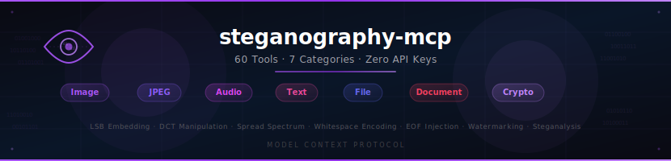

<p align="center">
  <a href="../../README.md">English</a> |
  <a href="README.zh.md">中文</a> |
  <a href="README.zh-TW.md">繁體中文</a> |
  <a href="README.ko.md">한국어</a> |
  <a href="README.ja.md">日本語</a> |
  <strong>Deutsch</strong> |
  <a href="README.es.md">Español</a> |
  <a href="README.fr.md">Français</a> |
  <a href="README.it.md">Italiano</a> |
  <a href="README.da.md">Dansk</a> |
  <a href="README.no.md">Norsk</a> |
  <a href="README.pl.md">Polski</a> |
  <a href="README.ru.md">Русский</a> |
  <a href="README.bs.md">Bosanski</a> |
  <a href="README.uk.md">Українська</a> |
  <a href="README.pt-BR.md">Português (BR)</a> |
  <a href="README.ar.md">العربية</a> |
  <a href="README.th.md">ไทย</a> |
  <a href="README.tr.md">Türkçe</a> |
  <a href="README.bn.md">বাংলা</a> |
  <a href="README.hi.md">हिन्दी</a> |
  <a href="README.el.md">Ελληνικά</a> |
  <a href="README.vi.md">Tiếng Việt</a>
</p>

<div align="center">
  <br>
  <picture>
    <source media="(prefers-color-scheme: dark)" srcset="../banner-dark.svg">
    <source media="(prefers-color-scheme: light)" srcset="../banner-light.svg">
    
  </picture>
</div>

<h3 align="center">Das umfassendste Steganographie-Analyse-Toolkit f&uuml;r KI-Agenten.</h3>

<p align="center">
  LSB-Erkennung, Chi-Quadrat-Steganalyse, RS-Analyse, DCT-Forensik, Audio-Steganographie, Zero-Width-Textcodierung, Datei-Forensik, Polyglot-Erkennung, Codierungsidentifikation &mdash; vereint in einem einzigen MCP-Server.<br>
  <b>60 Werkzeuge. 7 Kategorien. 4 Abh&auml;ngigkeiten. 100 % offline.</b> Keine API-Schl&uuml;ssel erforderlich. Jedes Werkzeug l&auml;uft lokal.
</p>

<br>

<p align="center">
  <a href="#das-problem">Das Problem</a> &bull;
  <a href="#was-es-anders-macht">Was es anders macht</a> &bull;
  <a href="#schnellstart">Schnellstart</a> &bull;
  <a href="#was-die-ki-kann">Was die KI kann</a> &bull;
  <a href="#werkzeug-referenz-60-werkzeuge">Werkzeuge (60)</a> &bull;
  <a href="#cli-nutzung">CLI-Nutzung</a> &bull;
  <a href="#architektur">Architektur</a> &bull;
  <a href="../../CONTRIBUTING.md">Mitwirken</a>
</p>

<p align="center">
  <a href="https://www.npmjs.com/package/steganography-mcp"></a>
  <a href="https://www.npmjs.com/package/steganography-mcp"></a>
  <a href="../../LICENSE"></a>
  = 18">
  
  
  
  
  <a href="https://github.com/badchars/steganography-mcp"></a>
</p>

---

## Das Problem

Steganographie ist die Kunst, Daten vor aller Augen zu verbergen &mdash; in Bildern, Audiodateien, Dokumenten und sogar in Unicode-Text. Sie wird in CTF-Wettbewerben, digitalen forensischen Untersuchungen, verdeckten Kommunikationskan&auml;len und Malware-Payloads eingesetzt. Die Erkennung erfordert eine Kombination aus statistischer Analyse, formatspezifischem Parsen, Entropie-Messung und Fachwissen.

```
Traditioneller Steganographie-Analyse-Workflow:
  Bild-Stego erkennen            ->  zsteg + stegsolve (2 Tools, Ruby + Java)
  Chi-Quadrat-Analyse             ->  eigenes Python-Skript
  RS-Analyse                      ->  eigener MATLAB/Python-Code
  JPEG-DCT-Forensik               ->  stegdetect (aufgegebenes C-Tool von 2004)
  LSB-Daten extrahieren           ->  zsteg + steghide + openstego (3 Tools)
  Audio-Steganographie            ->  Audacity manuell + eigene Skripte
  Zero-Width-Texterkennung        ->  Web-Tools + manuelle Pr&uuml;fung
  Datei-Forensik / binwalk        ->  binwalk + foremost + xxd (3 Tools)
  EXIF-Metadaten                  ->  exiftool (Perl-Abh&auml;ngigkeit)
  Codierungserkennung             ->  CyberChef Web-UI + manuelles Raten
  ─────────────────────────────────
  Gesamt: 10+ Tools, 5+ Sprachen, stundenlange manuelle Korrelation
```

**steganography-mcp** gibt Ihrem KI-Agenten 60 Werkzeuge in 7 Kategorien &uuml;ber das [Model Context Protocol](https://modelcontextprotocol.io). Der Agent f&uuml;hrt Bild-Steganalyse, JPEG-Forensik, Audio-Analyse, Text-Steganographie-Erkennung, Datei-Forensik, Dokumentenanalyse und Codierungsidentifikation durch &mdash; alles in einer einzigen Konversation, alles 100 % lokal und ohne Abh&auml;ngigkeit von externen Diensten.

```
Mit steganography-mcp:
  Sie: "Analysiere dieses CTF-Challenge-Bild auf versteckte Daten"

  Agent: -> img_detect: Chi-Quadrat p=0,0001 (LSB-Einbettung erkannt),
            RS-Analyse sch&auml;tzt 42 % Einbettungsrate, Entropie-Anomalie
            im unteren rechten Quadranten
         -> img_lsb_extract: 847 Bytes aus RGB-LSBs extrahiert
         -> crypto_detect: Extrahierte Daten sind Base64-codiert
         -> crypto_decode: Decodiert zu "FLAG{hidden_in_plain_sight_2024}"
         -> img_known_tools: Signatur-&Uuml;bereinstimmung mit OpenStego

         "Das Bild enth&auml;lt LSB-Steganographie, eingebettet mit OpenStego.
          Der Chi-Quadrat-Test best&auml;tigt LSB-Ersetzung in allen drei
          RGB-Kan&auml;len mit 42 % Einbettungsrate. Die versteckte Nutzlast
          ist Base64-codiert und decodiert zur Flagge:
          FLAG{hidden_in_plain_sight_2024}"
```

---

## Was es anders macht

Die meisten Steganographie-Tools sind Einzweck-Werkzeuge. steganography-mcp gibt Ihrem KI-Agenten die F&auml;higkeit, **&uuml;ber alle Steganographie-Techniken gleichzeitig zu schlussfolgern**.

<table>
<thead>
<tr>
<th></th>
<th>Traditioneller Ansatz</th>
<th>steganography-mcp</th>
</tr>
</thead>
<tbody>
<tr>
<td><b>Schnittstelle</b></td>
<td>10+ CLI-Tools, 5+ Sprachen, Web-UIs</td>
<td>MCP &mdash; KI-Agent ruft Werkzeuge konversationell auf</td>
</tr>
<tr>
<td><b>Abdeckung</b></td>
<td>Eine Technik auf einmal</td>
<td>7 Kategorien, 60 Werkzeuge parallel</td>
</tr>
<tr>
<td><b>Bildanalyse</b></td>
<td>zsteg (Ruby), stegsolve (Java), eigene Skripte</td>
<td>Agent f&uuml;hrt Chi-Quadrat, RS-Analyse, SPA, Entropie-Karte, Histogramm, Bit-Ebenen-Extraktion, Metadaten und Tool-Signatur-Erkennung durch &mdash; alles gleichzeitig</td>
</tr>
<tr>
<td><b>JPEG-Forensik</b></td>
<td>stegdetect (aufgegeben), manuelle DCT-Pr&uuml;fung</td>
<td>Agent analysiert DCT-Histogramm, Doppelkompression, Quantisierungstabellen, EXIF-Tiefenanalyse, Thumbnail-Vergleich, Kommentarfelder</td>
</tr>
<tr>
<td><b>Audio-Stego</b></td>
<td>Audacity + manuelle LSB-Skripte</td>
<td>Agent f&uuml;hrt LSB-Chi-Quadrat, Spektralanalyse, Stille-Bereich-LSB-Pr&uuml;fung, Echo-Hiding-Erkennung, Metadaten-Extraktion durch</td>
</tr>
<tr>
<td><b>Text-Stego</b></td>
<td>Web-Tools, manuelle Pr&uuml;fung</td>
<td>Agent erkennt Zero-Width-Zeichen, Whitespace-Codierung, unsichtbare Unicode-Zeichen, Homoglyphen, Akrostichen &mdash; und kann ZWC-Nachrichten einbetten/extrahieren</td>
</tr>
<tr>
<td><b>Abh&auml;ngigkeiten</b></td>
<td>Ruby, Java, Perl, Python, C, Web-Tools</td>
<td><code>npx -y steganography-mcp</code> &mdash; 4 Abh&auml;ngigkeiten, reines TypeScript</td>
</tr>
<tr>
<td><b>API-Schl&uuml;ssel</b></td>
<td>N/A (aber fragmentierte Toolchain)</td>
<td>Null. 100 % offline, keine externen Aufrufe</td>
</tr>
<tr>
<td><b>Ausgabe</b></td>
<td>Rohtext, Bilder, manuelle Korrelation</td>
<td>Strukturiertes JSON &mdash; KI korreliert Ergebnisse automatisch</td>
</tr>
</tbody>
</table>

---

## Schnellstart

### Option 1: npx (keine Installation)

```bash
npx -y steganography-mcp
```

Alle 60 Werkzeuge funktionieren sofort. Keine API-Schl&uuml;ssel. Keine Konfiguration. 100 % offline.

### Option 2: bunx (schneller)

```bash
bunx steganography-mcp
```

### Option 3: Klonen

```bash
git clone https://github.com/badchars/steganography-mcp.git
cd steganography-mcp
bun install
```

### Verbindung mit Ihrem KI-Agenten

<details open>
<summary><b>Claude Code</b></summary>

```bash
# Mit npx
claude mcp add steganography -- npx -y steganography-mcp

# Mit lokalem Klon
claude mcp add steganography -- bun run /path/to/steganography-mcp/src/index.ts
```

</details>

<details>
<summary><b>Claude Desktop</b></summary>

Hinzuf&uuml;gen in `~/Library/Application Support/Claude/claude_desktop_config.json`:

```json
{
  "mcpServers": {
    "steganography": {
      "command": "npx",
      "args": ["-y", "steganography-mcp"]
    }
  }
}
```

</details>

<details>
<summary><b>Cursor / Windsurf / andere MCP-Clients</b></summary>

Gleiches JSON-Konfigurationsformat. Zeigen Sie den Befehl auf `npx -y steganography-mcp` oder Ihren lokalen Installationspfad.

</details>

### Analyse starten

```
Sie: "Pr&uuml;fe dieses Bild auf versteckte Daten"
```

Das ist alles. Der Agent f&uuml;hrt Chi-Quadrat-Analyse, RS-Analyse, Entropie-Mapping, Metadaten-Extraktion, Erkennung angeh&auml;ngter Daten und Tool-Signatur-Scan durch &mdash; vollautomatisch.

---

## Was die KI kann

### CTF-Challenge-L&ouml;ser

```
Sie: "L&ouml;se diese CTF-Steganographie-Challenge — das Bild ist unter challenge.png"

Agent: -> img_detect: Chi-Quadrat-Steganalyse erkennt LSB-Einbettung
          (p=0,00012), RS-Analyse sch&auml;tzt 38 % Einbettungsrate,
          Entropie-Anomalie bei Bl&ouml;cken (12,4)-(15,8)
       -> img_lsb_extract: 1.247 Bytes aus RGB-Kanal-LSBs extrahiert
       -> crypto_detect: Daten entsprechen Base64-Muster (Konfidenz: 0,95)
       -> crypto_decode: "Q1RGe3N0M2cwX21hc3Rlcn0=" -> "CTF{st3g0_master}"
       -> img_known_tools: OpenStego-Signatur in PNG-Chunks erkannt

       "Flagge gefunden: CTF{st3g0_master}
        Das Bild verwendet LSB-Steganographie, eingebettet durch OpenStego.
        Die Nutzlast war Base64-codiert in den RGB-Least-Significant-Bits
        mit einer Einbettungsrate von 38 %."
```

### Digitale forensische Untersuchung

```
Sie: "Analysiere suspect.png und suspect.wav auf verdeckte Kommunikation"

Agent: -> img_detect: Keine LSB-Stego erkannt, aber angeh&auml;ngte Daten gefunden
          (12.847 Bytes nach PNG-IEND-Marker)
       -> file_identify: Angeh&auml;ngte Daten beginnen mit ZIP-Signatur (PK)
       -> img_metadata: PNG tEXt-Chunk enth&auml;lt ungew&ouml;hnlichen Schl&uuml;ssel "comm"
          mit Base64-Wert
       -> audio_detect: WAV-Datei hat LSB-Chi-Quadrat-Anomalie (p=0,003)
       -> audio_silence: 3 stille Abschnitte mit aktiven LSBs erkannt
       -> audio_lsb_extract: 2.048 Bytes versteckter Daten extrahiert

       "Beide Dateien enthalten versteckte Daten:
        1. suspect.png hat ein ZIP-Archiv nach dem PNG-EOF-Marker angeh&auml;ngt,
           plus eine Base64-codierte Nachricht in den Metadaten
        2. suspect.wav enth&auml;lt LSB-Steganographie, speziell in stillen
           Abschnitten — ein starker Indikator f&uuml;r absichtliches Verbergen.
        Empfehlung: ZIP extrahieren und WAV-Nutzlast analysieren."
```

### Zero-Width-Text-Erkennung

```
Sie: "Diese E-Mail sieht normal aus, k&ouml;nnte aber versteckten Text enthalten"

Agent: -> text_detect: 847 Zero-Width-Zeichen zwischen sichtbaren
          Zeichen erkannt
       -> text_zwc_detect: ZWSP (342), ZWNJ (505) an 127 Positionen
          im gesamten Text gefunden
       -> text_zwc_extract: Bin&auml;re Decodierung ergibt "EXFIL-ROUTE-7"
       -> text_invisible_scan: 3 zus&auml;tzliche unsichtbare Unicode-Zeichen
          (U+2060, U+FEFF) im Header-Bereich gefunden

       "Die E-Mail enth&auml;lt eine versteckte Nachricht, codiert mit
        Zero-Width-Zeichen: 'EXFIL-ROUTE-7'. 847 unsichtbare Zeichen
        sind &uuml;ber den sichtbaren Text verteilt, unter Verwendung von
        ZWSP/ZWNJ-Bin&auml;rcodierung. Zus&auml;tzlich wurden 3 Word-Joiner-
        und BOM-Zeichen im Header gefunden — vermutlich Metadaten-Artefakte."
```

### JPEG-forensische Analyse

```
Sie: "Ist dieses JPEG-Bild authentisch oder wurde es manipuliert?"

Agent: -> jpeg_structure: 14 Marker geparst, normale JFIF-Struktur
       -> jpeg_double_compression: Doppelkompression ERKANNT —
          Blocking-Artefakt-Score 0,73, Quantisierungs-Anomalie-Verh&auml;ltnis 0,81
       -> jpeg_quantization: Qualit&auml;t ~75 (Luminanz), aber Residualmuster
          deuten auf urspr&uuml;ngliche Qualit&auml;t ~92 hin
       -> jpeg_exif_deep: EXIF sagt "iPhone 14 Pro", aber Software-Feld
          sagt "Adobe Photoshop 25.0"
       -> jpeg_thumbnail_compare: Thumbnail-Abmessungen stimmen NICHT mit
          dem Hauptbild &uuml;berein (Thumbnail: 4032x3024, Hauptbild: 2048x1536)

       "Dieses JPEG wurde manipuliert. Beweise:
        1. Doppelkompression erkannt — das Bild wurde decodiert und mit
           geringerer Qualit&auml;t neu codiert (Original ~92, aktuell ~75)
        2. EXIF behauptet iPhone 14 Pro, aber das Software-Feld verr&auml;t
           Photoshop-Bearbeitung
        3. Thumbnail stammt von der originalen 4032x3024-Aufnahme, aber
           das Hauptbild wurde auf 2048x1536 skaliert
        Alle drei Befunde best&auml;tigen unabh&auml;ngig voneinander eine
        nachtr&auml;gliche Modifikation."
```

---

## Werkzeug-Referenz (60 Werkzeuge)

### Kategorie-&Uuml;bersicht

| Kategorie | Werkzeuge | Beschreibung |
|-----------|-----------|--------------|
| [Bild-Steganalyse](#-bild-steganalyse-14) | 14 | LSB-Erkennung, Chi-Quadrat, RS-Analyse, Entropie-Mapping, Bit-Ebenen, Histogramm, Metadaten, Tool-Signaturen |
| [JPEG-Analyse](#-jpeg-analyse-7) | 7 | DCT-Histogramm, Doppelkompression, Quantisierungstabellen, tiefe EXIF-Analyse, Thumbnail-Forensik, Kommentaranalyse |
| [Audio-Steganalyse](#-audio-steganalyse-7) | 7 | WAV-LSB-Erkennung, Spektralanalyse, Stille-Bereich-Analyse, Echo-Hiding, Metadaten-Extraktion |
| [Text & Unicode](#-text--unicode-10) | 10 | Zero-Width-Zeichen, Whitespace-Codierung, unsichtbare Unicode-Zeichen, Homoglyphen, Akrostichen, Unicode-Analyse |
| [Datei-Forensik](#-datei-forensik-10) | 10 | Magic Bytes, Polyglot-Erkennung, eingebettete Dateien, angeh&auml;ngte Daten, Entropie, Hex-Dump, Strings, Header |
| [Dokumentenanalyse](#-dokumentenanalyse-5) | 5 | PDF-versteckte Inhalte, PDF-Metadaten, PDF-Streams, HTML-versteckte Inhalte, XML-Metadaten |
| [Codierung & Kryptographie](#-codierung--kryptographie-7) | 7 | Codierungserkennung, Multi-Format-Decoder, Frequenzanalyse, Entropie, XOR-Brute-Force, Hash-ID, Chiffre-Muster |

---

<details open>
<summary><h3>Bild-Steganalyse (14)</h3></summary>

| Werkzeug | Beschreibung |
|----------|--------------|
| `img_detect` | Automatische Steganographie-Erkennung in einem Bild. F&uuml;hrt Chi-Quadrat, RS-Analyse, Entropie, Metadaten, angeh&auml;ngte Daten und Tool-Signatur-Pr&uuml;fungen durch. Gibt einen umfassenden JSON-Bericht zur&uuml;ck |
| `img_lsb_detect` | Statistische LSB-Steganographie-Erkennung. F&uuml;hrt Chi-Quadrat- und Sample-Pair-Analyse auf jedem Farbkanal unabh&auml;ngig durch |
| `img_lsb_extract` | Versteckte Daten aus Bild-LSBs extrahieren. Extrahiert Bits aus angegebenen Kan&auml;len und Bit-Ebenen, versucht UTF-8-Decodierung und zeigt Hex-Dump |
| `img_lsb_embed` | Eine Nachricht mittels LSB-Steganographie in ein Bild einbetten. Liest eine PNG-Datei, bettet die Nachricht in die niederwertigsten Bits ein und schreibt eine neue PNG-Datei |
| `img_bitplane` | Eine bestimmte Bit-Ebene eines Bildkanals extrahieren und visualisieren. Zeigt Abmessungen, Prozentsatz der 1-Bits und eine ASCII-Art-Vorschau |
| `img_chi_square` | Chi-Quadrat-Steganalyse-Angriff auf jeden Farbkanal einzeln. Erkennt LSB-Ersetzung durch Pr&uuml;fung, ob benachbarte Pixelwert-Paare ausgeglichen sind |
| `img_rs_analysis` | RS-Analyse (Regular-Singular) nach der Fridrich-Goljan-Du-Methode. Analysiert Pixelgruppen zur Sch&auml;tzung der LSB-Einbettungsrate pro Kanal |
| `img_histogram` | Pixelwert-Histogramm mit Anomalie-Erkennung erstellen. Erkennt Pairs-of-Values (PoV)-Anomalien, die auf LSB-Steganographie hindeuten |
| `img_entropy_map` | Blockweise Entropie-Analyse eines Bildes. Teilt das Bild in Bl&ouml;cke und berechnet Shannon-Entropie pro Block, markiert Regionen mit hoher Entropie |
| `img_metadata` | Tiefgehende Metadaten-Extraktion aus einem Bild. F&uuml;r PNG: Text-Chunks, Chunk-Liste, IHDR-Info. F&uuml;r JPEG: EXIF, Kommentare, Quantisierungstabellen, Marker-Liste |
| `img_appended_data` | Daten erkennen und extrahieren, die nach dem Bild-EOF-Marker angeh&auml;ngt sind. Pr&uuml;ft auf versteckte Daten hinter PNG IEND, JPEG EOI oder BMP-Dateigr&ouml;&szlig;engrenze |
| `img_compare` | Pixel-f&uuml;r-Pixel-Vergleich zweier Bilder. Meldet identische/unterschiedliche Pixelanzahl, maximale Differenz und welche Kan&auml;le betroffen sind |
| `img_channel_analysis` | Statistische Analyse pro Kanal f&uuml;r R, G, B und A. Meldet Mittelwert, Standardabweichung, Entropie, Min, Max und Anzahl einzigartiger Werte |
| `img_known_tools` | Bild-Dateibytes auf bekannte Steganographie-Tool-Signaturen scannen. Pr&uuml;ft gegen eine Datenbank von Mustern aus OpenStego, Steghide, JSteg, F5 und anderen |

</details>

<details>
<summary><h3>JPEG-Analyse (7)</h3></summary>

| Werkzeug | Beschreibung |
|----------|--------------|
| `jpeg_structure` | JPEG-Marker/Segmente mit Offsets und Gr&ouml;&szlig;en parsen. Zeigt die interne Struktur einschlie&szlig;lich aller Marker, Positionen und Segmentl&auml;ngen |
| `jpeg_dct_histogram` | DCT-Koeffizientenverteilungsanalyse zur Steganographie-Erkennung. Analysiert die Y-Kanal-Pixelwertverteilung und SOS-Entropiedaten zur Erkennung von Anomalien durch JSteg, F5 und OutGuess |
| `jpeg_double_compression` | Doppelte JPEG-Kompressionsartefakte erkennen. Identifiziert charakteristische Blocking-Artefakte und Quantisierungstabellen-Anomalien &mdash; ein h&auml;ufiger Indikator f&uuml;r Bildmanipulation oder Stego-Einbettung |
| `jpeg_quantization` | Quantisierungstabellen-Analyse mit Qualit&auml;tssch&auml;tzung. Zeigt alle Quantisierungstabellen im 8x8-Gitterformat und sch&auml;tzt den JPEG-Qualit&auml;tsfaktor |
| `jpeg_exif_deep` | Tiefe EXIF-Analyse einschlie&szlig;lich GPS-Koordinaten, Zeitstempel, Software-Info, Thumbnails, Maker Notes und allen IFD-Eintr&auml;gen. Markiert forensisch interessante Felder |
| `jpeg_thumbnail_compare` | EXIF-Thumbnail mit dem JPEG-Hauptbild vergleichen. Abmessungs- oder Inhaltsdiskrepanz deutet auf nachtr&auml;gliche Modifikation hin &mdash; ein h&auml;ufiges forensisches Artefakt |
| `jpeg_comment` | JPEG-COM-(Kommentar)-Marker extrahieren und analysieren. Pr&uuml;ft auf versteckte Datenmuster, ungew&ouml;hnlich gro&szlig;e Kommentare und Inhalte mit hoher Entropie |

</details>

<details>
<summary><h3>Audio-Steganalyse (7)</h3></summary>

| Werkzeug | Beschreibung |
|----------|--------------|
| `audio_detect` | Automatische Audio-Steganographie-Erkennung in einer WAV-Datei. F&uuml;hrt LSB-Chi-Quadrat, Entropie-Analyse, Metadaten-Inspektion und Pr&uuml;fung auf angeh&auml;ngte Daten durch |
| `audio_lsb_detect` | Statistische PCM-Sample-LSB-Analyse. F&uuml;hrt einen Chi-Quadrat-Test auf nach Wertpaaren gruppierte LSBs durch, um LSB-Ersetzungs-Steganographie zu erkennen |
| `audio_lsb_extract` | LSB-Daten aus Audio-Samples extrahieren. Liest das niederwertigste Bit jedes PCM-Samples und versucht, versteckte Daten zu decodieren |
| `audio_spectrum` | Spektralanalyse f&uuml;r versteckte Signale in WAV-Audio. Analysiert Samplewert-Verteilung, Nulldurchgangsrate, RMS-Energie pro Block und erkennt anomale leise Abschnitte |
| `audio_metadata` | Metadaten aus einer WAV-Datei extrahieren, einschlie&szlig;lich RIFF-INFO-Chunks, Formatdetails und aller Chunk-Informationen |
| `audio_silence` | Stille Abschnitte in WAV-Audio auf versteckte Daten analysieren. Findet Regionen nahe null und pr&uuml;ft deren LSBs &mdash; stille Abschnitte mit aktiven LSBs sind ein starker Stego-Indikator |
| `audio_echo_detect` | Echo-Hiding-Erkennung &uuml;ber Autokorrelationsanalyse. Berechnet normalisierte Autokorrelation bei g&auml;ngigen Echo-Verz&ouml;gerungen. Regelm&auml;&szlig;ige Echomuster deuten auf steganographisches Echo-Hiding hin |

</details>

<details>
<summary><h3>Text & Unicode (10)</h3></summary>

| Werkzeug | Beschreibung |
|----------|--------------|
| `text_detect` | Automatische Text-Steganographie-Erkennung. Pr&uuml;ft auf Zero-Width-Zeichen, Whitespace-Codierung, unsichtbare Unicode-Zeichen, Homoglyphen und ungew&ouml;hnliche Muster |
| `text_zwc_detect` | Zero-Width-Zeichen (ZWSP, ZWNJ, ZWJ, BOM) im Text erkennen. Meldet Positionen, Z&auml;hlungen und potenzielle L&auml;nge der codierten Nachricht |
| `text_zwc_extract` | Eine mit Zero-Width-Zeichen codierte Nachricht decodieren. Extrahiert ZWC-Zeichen und decodiert bin&auml;r: ZWSP=0, ZWNJ=1 (versucht beide Polarit&auml;ten) |
| `text_zwc_embed` | Eine geheime Nachricht mittels Zero-Width-Zeichen in einen Decktext einbetten. Codiert die Nachricht bin&auml;r und ordnet Bits ZWSP(0)/ZWNJ(1) zu |
| `text_whitespace_detect` | Whitespace-Codierung in Text erkennen. Pr&uuml;ft jede Zeile auf nachfolgende Whitespace-Muster, bei denen Leerzeichen=0 und Tab=1 Bin&auml;rdaten codieren k&ouml;nnten |
| `text_whitespace_extract` | Eine Whitespace-codierte Nachricht aus Text extrahieren. Liest nachfolgende Whitespace-Zeichen jeder Zeile und decodiert Leerzeichen=0/Tab=1 Bin&auml;rcodierung |
| `text_invisible_scan` | Text auf ALLE unsichtbaren Unicode-Zeichen scannen. Pr&uuml;ft jedes Zeichen gegen die vollst&auml;ndige Datenbank unsichtbarer Zeichen und meldet Positionen und Namen |
| `text_homoglyph` | Unicode-Homoglyphen-Substitutionen in Text erkennen. Identifiziert Nicht-ASCII-Zeichen, die visuell ASCII-Buchstaben &auml;hneln (kyrillisches a vs. lateinisches a usw.) |
| `text_unicode_analysis` | Vollst&auml;ndige Unicode-Zeichenverteilungsanalyse. Kategorisiert alle Zeichen nach Skriptblock, f&uuml;hrt Entropie-Analyse durch und erkennt verd&auml;chtiges Skript-Mischen |
| `text_acrostic` | Erkennung von Erstbuchstaben-, Erstwort-, Letztbuchstaben-, Letztwort- oder N-tes-Zeichen-Mustern (Akrostichon-Nachrichten) &uuml;ber Textzeilen hinweg |

</details>

<details>
<summary><h3>Datei-Forensik (10)</h3></summary>

| Werkzeug | Beschreibung |
|----------|--------------|
| `file_identify` | Dateityp-Identifikation &uuml;ber Magic Bytes. Liest den Datei-Header und gleicht ihn mit einer umfassenden Datenbank bekannter Dateisignaturen ab. Pr&uuml;ft auf Erweiterungsdiskrepanz |
| `file_polyglot` | Polyglot-Dateien erkennen, die als zwei oder mehr Formate gleichzeitig g&uuml;ltig sind. Pr&uuml;ft auf mehrere g&uuml;ltige Dateisignaturen an verschiedenen Offsets (PDF+ZIP, PNG+PDF usw.) |
| `file_embedded` | Eingebettete Dateien in einer Bin&auml;rdatei suchen, &auml;hnlich wie binwalk. Sucht nach bekannten Magic-Byte-Signaturen an jedem Offset, um versteckte oder angeh&auml;ngte Dateien zu entdecken |
| `file_appended` | Daten erkennen, die nach dem formatspezifischen EOF-Marker einer Datei angeh&auml;ngt sind. Unterst&uuml;tzt PNG (IEND), JPEG (FFD9), BMP, ZIP (EOCD) und PDF (%%EOF) |
| `file_entropy` | Abschnittsweise Entropie-Analyse. Berechnet Shannon-Entropie pro Block und insgesamt, markiert anomale Abschnitte mit hoher Entropie |
| `file_entropy_visual` | ASCII-Entropie-Visualisierung einer Datei. Rendert ein textbasiertes Balkendiagramm, das Entropie-Niveaus &uuml;ber die Datei zeigt, zur visuellen Anomalie-Erkennung |
| `file_strings` | Druckbare und Unicode-Zeichenketten aus Bin&auml;rdateien extrahieren. Sucht nach Folgen druckbarer Zeichen und meldet sie mit Datei-Offsets. Unterst&uuml;tzt ASCII, UTF-8, UTF-16 |
| `file_hex` | Hex-Dump mit ASCII-Seitenleiste. Traditionelles Hex-Editor-Format mit Offset-Adressen, Hex-Bytes und druckbarer ASCII-Darstellung |
| `file_header` | Tiefgehende Header- und Strukturanalyse f&uuml;r bekannte Formate. Parst PNG IHDR, JPEG SOF, BMP-Info-Header, ZIP-Local-File-Header und PDF-Version/Metadaten |
| `file_compare` | Bin&auml;rer Diff zwischen zwei Dateien. Byte-f&uuml;r-Byte-Vergleich mit Meldung von Unterschieden, Offsets, Prozentsatz identisch und LSB-only-Differenz-Erkennung f&uuml;r Stego-Analyse |

</details>

<details>
<summary><h3>Dokumentenanalyse (5)</h3></summary>

| Werkzeug | Beschreibung |
|----------|--------------|
| `doc_pdf_hidden` | Versteckte PDF-Inhalte erkennen. Sucht nach JavaScript, automatischen Aktionen, OpenAction, versteckten Annotationen, unsichtbarem Text, eingebetteten Dateien und anderen verdeckten Inhalten |
| `doc_pdf_metadata` | PDF-Metadaten-Extraktion. Parst das /Info-Dictionary und XMP-Metadatenbl&ouml;cke f&uuml;r forensische Zuordnung und Dokumentenherkunftsanalyse |
| `doc_pdf_streams` | PDF-Stream-Analyse. Findet alle stream/endstream-Bl&ouml;cke, versucht zlib-Dekompression und meldet Gr&ouml;&szlig;en und Entropie zur Auffindung versteckter Daten |
| `doc_html_hidden` | Versteckte HTML-Inhalte erkennen. Sucht nach Kommentaren, display:none-Elementen, data-*-Attributen, versteckten Eingaben, Base64-Inhalten, Null-Gr&ouml;&szlig;en-Elementen und unsichtbarem Text |
| `doc_xml_metadata` | XML- und Office-Dokument-Metadaten-Extraktion. Parst Dublin Core, Microsoft Office-Eigenschaften, Verarbeitungsanweisungen und andere Metadatenfelder |

</details>

<details>
<summary><h3>Codierung & Kryptographie (7)</h3></summary>

| Werkzeug | Beschreibung |
|----------|--------------|
| `crypto_detect` | Automatische Codierungstyp-Erkennung einer Eingabezeichenkette. Testet gegen alle bekannten Muster (Base64, Hex, Bin&auml;r, Morse, URL-Codierung, HTML-Entit&auml;ten usw.) und gibt Treffer sortiert nach Konfidenz zur&uuml;ck |
| `crypto_decode` | Multi-Format-Decoder mit Unterst&uuml;tzung f&uuml;r Base64, Hex, Bin&auml;r, Dezimal, Oktal, URL-Codierung, ROT13, Base32, Morse-Code und HTML-Entit&auml;ten. Auto-Modus erkennt die Codierung zuerst |
| `crypto_frequency` | Zeichenh&auml;ufigkeitsanalyse f&uuml;r Kryptoanalyse. Z&auml;hlt Zeichenvorkommen, vergleicht mit der englischen Standard-H&auml;ufigkeit (ETAOINSHRDLU) und berechnet den Koinzidenzindex |
| `crypto_entropy` | Shannon-Entropie-Berechnung und -Klassifizierung f&uuml;r Zeichenketten. Berechnet Zeichen- und Byte-Entropie und klassifiziert in Kategorien von wiederholten Daten bis verschl&uuml;sselt/zuf&auml;llig |
| `crypto_xor` | XOR-Schl&uuml;ssel-Brute-Force f&uuml;r Einzel- und Mehrbyte-Schl&uuml;ssel. Probiert alle 256 Einzelbyte-Schl&uuml;ssel und bewertet nach Wahrscheinlichkeit f&uuml;r englischen Text. Nutzt IC zur Mehrbyte-Schl&uuml;ssell&auml;ngensch&auml;tzung |
| `crypto_hash_id` | Hash-Typ-Identifikation. Gleicht die Eingabe mit bekannten Hash-Mustern nach L&auml;nge und Format ab (MD5, SHA-1, SHA-256, SHA-512, bcrypt, CRC32, NTLM usw.) |
| `crypto_patterns` | Bekannte Chiffre- und Codierungsmuster-Erkennung. Analysiert Text auf Caesar-Chiffre, Substitutionschiffre, Vigen&egrave;re, Rail-Fence-Transposition, Atbash und umgekehrten Text |

</details>

---

## CLI-Nutzung

```bash
# Hilfe anzeigen
npx -y steganography-mcp --help

# Alle 60 Werkzeuge mit Beschreibungen auflisten
npx -y steganography-mcp --list

# Steganographie in einem Bild erkennen
npx -y steganography-mcp --tool img_detect '{"file_path":"challenge.png"}'

# Versteckte Nachricht aus LSBs extrahieren
npx -y steganography-mcp --tool img_lsb_extract '{"file_path":"stego.png"}'

# Chi-Quadrat-Steganalyse
npx -y steganography-mcp --tool img_chi_square '{"file_path":"suspect.png"}'

# RS-Analyse (Fridrich-Goljan-Du-Methode)
npx -y steganography-mcp --tool img_rs_analysis '{"file_path":"suspect.png"}'

# JPEG-Doppelkompressions-Erkennung
npx -y steganography-mcp --tool jpeg_double_compression '{"file_path":"photo.jpg"}'

# Tiefe EXIF-Analyse
npx -y steganography-mcp --tool jpeg_exif_deep '{"file_path":"photo.jpg"}'

# Audio-Steganographie-Erkennung
npx -y steganography-mcp --tool audio_detect '{"file_path":"message.wav"}'

# Zero-Width-Zeichencodierung erkennen
npx -y steganography-mcp --tool text_zwc_detect '{"text":"verd&auml;chtiger Text hier"}'

# Versteckte Nachricht mit Zero-Width-Zeichen einbetten
npx -y steganography-mcp --tool text_zwc_embed '{"text":"Decktext","message":"geheim"}'

# Dateityp identifizieren und Polyglots erkennen
npx -y steganography-mcp --tool file_polyglot '{"file_path":"verdaechtig.pdf"}'

# Nach eingebetteten Dateien scannen (binwalk-Stil)
npx -y steganography-mcp --tool file_embedded '{"file_path":"mystery.bin"}'

# Entropie-Visualisierung
npx -y steganography-mcp --tool file_entropy_visual '{"file_path":"data.bin"}'

# Codierung automatisch erkennen
npx -y steganography-mcp --tool crypto_detect '{"input":"aGVsbG8gd29ybGQ="}'

# XOR-Brute-Force
npx -y steganography-mcp --tool crypto_xor '{"input":"4f5243484e"}'

# Chiffre-Muster erkennen
npx -y steganography-mcp --tool crypto_patterns '{"input":"Gur dhvpx oebja sbk"}'

# Mit Bun (schnellerer Start)
bunx steganography-mcp --tool img_detect '{"file_path":"image.png"}'
```

---

## Anwendungsf&auml;lle

### CTF-Challenges
L&ouml;sen Sie Steganographie-Aufgaben in Capture-the-Flag-Wettbewerben. Der KI-Agent kann systematisch alle Erkennungstechniken anwenden &mdash; LSB-Analyse, Metadaten-Inspektion, angeh&auml;ngte Daten, Codierungserkennung und Chiffre-Identifikation &mdash; um versteckte Flaggen in Bildern, Audiodateien, Dokumenten und Text zu finden.

### Digitale Forensik
Erkennen Sie verdeckte Kommunikationskan&auml;le in forensischen Untersuchungen. Analysieren Sie verd&auml;chtige Dateien auf versteckte Daten mittels statistischer Steganalyse (Chi-Quadrat, RS-Analyse), pr&uuml;fen Sie auf Daten nach EOF-Markern, scannen Sie nach eingebetteten Dateien und identifizieren Sie Steganographie-Tool-Signaturen.

### Sicherheitsforschung
Analysieren Sie Steganographie-Tools und -Techniken. Vergleichen Sie Original- und Stego-Bilder Pixel f&uuml;r Pixel, untersuchen Sie DCT-Koeffizientenverteilungen in JPEG-Stego, messen Sie Entropie&auml;nderungen durch Einbettung und analysieren Sie Codierungsverfahren mittels Reverse Engineering.

### Ausbildung
Lernen Sie, wie Steganographie-Techniken funktionieren. Betten Sie LSB-Nachrichten ein und extrahieren Sie sie, codieren Sie Text mit Zero-Width-Zeichen, visualisieren Sie Bit-Ebenen und Entropie-Karten, analysieren Sie Dateistrukturen mit Hex-Dumps und studieren Sie Chiffre-Muster mit Frequenzanalyse.

### Incident Response
Pr&uuml;fen Sie w&auml;hrend der Incident Response Dokumente und Bilder auf versteckte Exfiltrations-Kan&auml;le. Scannen Sie PDFs auf verstecktes JavaScript und eingebettete Dateien, erkennen Sie Zero-Width-Zeichencodierung in E-Mails, identifizieren Sie Polyglot-Dateien und analysieren Sie verd&auml;chtige Codierungen.

---

## Architektur

```
src/
  index.ts                    # CLI-Einstiegspunkt (--help, --list, --tool, stdio-Server)
  protocol/
    mcp-server.ts             # MCP-Server-Setup (stdio-Transport)
    tools.ts                  # Werkzeug-Registry — alle 60 Werkzeuge hier zusammengestellt
  types/
    index.ts                  # Gemeinsame Typen (ToolDef, ToolContext, ToolResult)
  utils/
    binary.ts                 # Bin&auml;r-Dateilesen, Hex-Dump, Format-Erkennung
    stats.ts                  # Shannon-Entropie, Chi-Quadrat, Byte-Frequenz
    cache.ts                  # TTL-Cache
    png-parser.ts             # Reiner TS-PNG-Parser (IHDR, Chunks, Pixeldaten)
    jpeg-parser.ts            # Reiner TS-JPEG-Parser (Marker, EXIF, Quantisierung)
    wav-parser.ts             # Reiner TS-WAV-Parser (RIFF-Chunks, PCM-Samples)
    bmp-parser.ts             # Reiner TS-BMP-Parser (Header, Pixeldaten)
  image/                      # Bild-Steganalyse-Werkzeuge (14)
  jpeg/                       # JPEG-Analyse-Werkzeuge (7)
  audio/                      # Audio-Steganalyse-Werkzeuge (7)
  text/                       # Text & Unicode-Werkzeuge (10)
  file/                       # Datei-Forensik-Werkzeuge (10)
  document/                   # Dokumentenanalyse-Werkzeuge (5)
  crypto/                     # Codierung & Kryptographie-Werkzeuge (7)
  data/
    encoding-patterns.ts      # Codierungs-Regex-Muster + Decoder
    magic-bytes.ts            # Dateisignatur-Datenbank (100+ Formate)
    stego-signatures.ts       # Bekannte Steganographie-Tool-Signaturen
    unicode-invisible.ts      # Unsichtbare Unicode-Zeichen-Datenbank
```

**Design-Entscheidungen:**

- **4 Abh&auml;ngigkeiten, sonst nichts** &mdash; `@modelcontextprotocol/sdk` f&uuml;r das MCP-Protokoll, `zod` f&uuml;r Eingabevalidierung, `pngjs` f&uuml;r PNG-Pixelzugriff, `jpeg-js` f&uuml;r JPEG-Decodierung. Kein aufgebl&auml;hter Abh&auml;ngigkeitsbaum. Keine nativen Module. Keine C-Bindings. Kein Python. Kein Java.
- **100 % offline** &mdash; Jedes Werkzeug l&auml;uft vollst&auml;ndig lokal. Keine HTTP-Anfragen. Keine API-Aufrufe. Keine Telemetrie. Keine Cloud-Abh&auml;ngigkeiten. Ihre Dateien verlassen niemals Ihren Computer.
- **Reine TypeScript-statistische Analyse** &mdash; Chi-Quadrat-Test, RS-Analyse (Fridrich-Goljan-Du), Sample-Pair-Analyse, Shannon-Entropie, Koinzidenzindex und Frequenzanalyse sind alle in reinem TypeScript implementiert. Keine externen Mathematik-Bibliotheken.
- **Eigene Format-Parser** &mdash; PNG-Chunks, JPEG-Marker/EXIF/Quantisierungstabellen, WAV-RIFF-Chunks und BMP-Header werden mit null externen Abh&auml;ngigkeiten durch die `utils/`-Parser verarbeitet. Dies erm&ouml;glicht tiefgehende formatspezifische Analysen, die Universalbibliotheken nicht bieten k&ouml;nnen.
- **7 Provider, 1 Server** &mdash; Jede Analysekategorie ist ein unabh&auml;ngiges Modul. Der KI-Agent w&auml;hlt die Werkzeuge basierend auf dem Untersuchungskontext.
- **Sauberes ToolDef-Muster** &mdash; Jedes Werkzeug folgt dem gleichen `{ name, description, schema, execute }`-Muster. Ein neues Werkzeug hinzuzuf&uuml;gen bedeutet ein einzelnes Objekt im entsprechenden Modul.
- **Zod-Validierung auf jedem Feld** &mdash; Jedes Schemafeld hat `.describe()` f&uuml;r KI-Agenten-Kontext. Ung&uuml;ltige Eingaben werden vor der Ausf&uuml;hrung mit klaren Fehlermeldungen abgefangen.

---

## Teil der MCP Security Suite

| Projekt | Bereich | Werkzeuge |
|---------|---------|-----------|
| [hackbrowser-mcp](https://github.com/badchars/hackbrowser-mcp) | Browserbasierte Sicherheitstests | 39 Werkzeuge |
| [cloud-audit-mcp](https://github.com/badchars/cloud-audit-mcp) | Cloud-Sicherheit (AWS/Azure/GCP) | 38 Werkzeuge |
| [github-security-mcp](https://github.com/badchars/github-security-mcp) | GitHub-Sicherheitslage | 39 Werkzeuge |
| [cve-mcp](https://github.com/badchars/cve-mcp) | Schwachstellen-Intelligenz | 23 Werkzeuge |
| [osint-mcp-server](https://github.com/badchars/osint-mcp-server) | OSINT & Aufkl&auml;rung | 37 Werkzeuge |
| [darknet-mcp-server](https://github.com/badchars/darknet-mcp-server) | Darknet & Bedrohungsintelligenz | 66 Werkzeuge |
| [dns-security-mcp](https://github.com/badchars/dns-security-mcp) | DNS-Sicherheitsintelligenz | 103 Werkzeuge |
| **steganography-mcp** | **Steganographie-Analyse** | **60 Werkzeuge** |

---

## Mitwirken

Beitr&auml;ge sind willkommen. Siehe [CONTRIBUTING.md](../../CONTRIBUTING.md) f&uuml;r Richtlinien.

---

<p align="center">
<b>Nur f&uuml;r autorisierte Sicherheitsforschung und Bildungszwecke.</b><br>
Stellen Sie stets sicher, dass Sie eine ordnungsgem&auml;&szlig;e Genehmigung haben, bevor Sie Steganographie-Analysen an Dateien durchf&uuml;hren, die Ihnen nicht geh&ouml;ren.
</p>

<p align="center">
  <a href="../../LICENSE">MIT-Lizenz</a> &bull; Erstellt von <a href="https://orhanyildirim.us">Orhan Yildirim</a> &bull; <a href="mailto:contact@orhanyildirim.us">contact@orhanyildirim.us</a>
</p>
